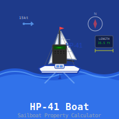

# hp-41_boat

## HP-41: Calculate various properties of a sail boat

For background information, see [US Sailing – Keelboat](http://www.sailingusa.info/design_winds.htm)

Upon XEQ "BOAT", the program first tells you that you need to set flag 1 if you are going to input the properties in SI values. If you input the properties in the imperial measurement system, simply leave flag 1 cleared – the program indicates this by showing "SF 01 FOR SI" for a second before it prompts for several properties of the sail boat:

**L:OVERALL?** 
The overall length of the boat

**L:WATERLINE?** 
The lenght of the boat at the water line

**L:BEAM?** 
Width of the beam (the broadest part of the boat)

**W:DISPLACEMT?** 
The weight of the boat

**W:BALAST?** 
The waight of the keel

**L:HULL DRAFT?** 
The depth of the boat (from water line to bottom of keel)

**A:SAIL AREA?** 
The total area of the sail(s)

Simply input the values you have and the program will calculate what it can with those values. If the the output parameters requires values that you have not entered, it will simply show three question marks instead of an output value. The output values are:

**HSPD,KT (Hull Speed in Knots)** 
The theoretical maximum speed of a hull displacement boat (a normal sail boat). Boats may be built for greater or lesser speed than this, but it serves as an indicator for how fast the boat should and could go

**SA/D (Sail Area Displacement ratio)** 
Indicates how fast the boat is in light wind:
* Cruising Boats have ratios between 10 and 15
* Cruiser-Racers have ratios between 16-20
* Racers have ratios above 20
* High-Performance Racers have ratios above 24

**D/L (Displacement to Length ratio)** 
Indicates if the boat is a heavy cruiser (results greater than 325) or a light displacement racing boat (results less than 200

**CSF (Capsize Screening Formula)** 
Estimation of the boat’s resistance to capsizing. This value is only for guidance. In general, heavy boats with narrow hulls are more stable. Results less than 2 indicate stability, greater than 2 the boat is more vulnerable to capsizing (cf. the next two values)

**SSV (Screening Stability Value)** 
An indication of stability in reference to risk of capsizing

**A.V.STAB (Angle of Vanishing Stability)** 
Sometimes referred to as the "AVS", "limit of positive stability", "LPS", or "Latent Stability Angle". The AVS is only one indicator in evaluating the likelihood of capsize, meaning it only predicts the point at which the vessel wants to turn turtle. It does not predict the amount of force that would be required to heel the vessel to that limit, nor does it predict how the shape of the boat might encourage wave action to roll the boat closer to the angle at which it no longer wants to return

**MCR (Motion Comfort Ratio)** 
Redicts the predicts the overall comfort of a boat when it is underway. The formula predicts the speed of the upward and downward motion of the boat as it encounters waves and swells. The faster the motion the more uncomfortable the passengers. The higher the number, the more resistant a boat is to movement. This ratio was created by boat designer, Ted Brewer. It is useful in comparing different boats. A higher value predicts a more comfortable ride. Asailboat with a LOA of 42 would be expected to have a Motion Comfort Ratio in the low 30’s

## License
This software is released into the Public Domain.
